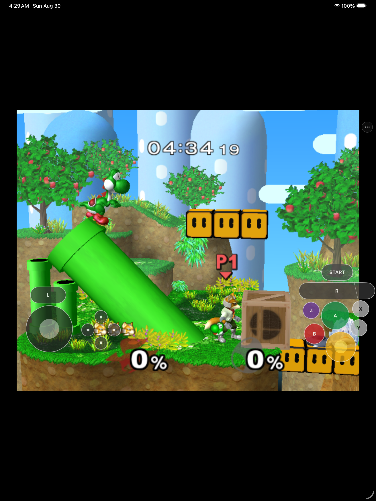

# SsbmPad

<p align="center">
  <strong>Super Smash Bros. Melee on iPhone, iPad, and Apple Silicon Mac through ahead-of-time recompilation and Metal.</strong><br>
  Native Apple app shells, mobile touch controls, controller support, and local user-supplied game-data import.
</p>

<p align="center">
  
</p>

<p align="center">
  
  
  
  
  
</p>



SsbmPad wraps a [DolRecomp](https://github.com/encounter/dolrecomp)-generated
GALE01 game module in a ModernGekko/Dolphin-derived compatibility runtime.
Covered PowerPC code runs as ahead-of-time-compiled Apple ARM64 code; Dolphin's
Metal backend renders into native Apple app surfaces. The mobile app imports a
user-provided supported disc image through Files and provides a customizable
touch controller alongside Apple GameController support. The macOS app provides
a native launcher, Metal rendering, keyboard/controller input, local settings,
and netplay-facing configuration.

This repository contains the Apple integration, source patches, tests, and
reproducible build tooling. It does **not** contain Melee, a disc image,
extracted Nintendo assets, saves, signing material, or a generated game module.

## Current status

SsbmPad is an engineering preview, not a finished release. The native macOS app
boots and plays coherent matches at approximately the original 59.94 Hz cadence
in established warm scenes, though strict worst-frame and remaining acceptance
work is still tracked. The same ahead-of-time game module boots on iPad and
iPhone Simulators with Metal, touch input, imported game data, persistent saves,
and diagnostics.

The mobile performance gate is still open: demanding iPad Simulator combat has
measured roughly 42–48 FPS with the current compatible PGO module, which can
starve audio. That is not considered playable or a 60 FPS pass. Physical-device
performance, complete controller lifecycle coverage, distribution signing, and
netplay acceptance remain future gates. The evidence-first loop and exact open
rows live in [`docs/GOAL-LOOP.md`](docs/GOAL-LOOP.md) and
[`docs/STATUS.md`](docs/STATUS.md).

| Area | Verified now | Still open |
|---|---|---|
| macOS | Native arm64 launcher/runner, Metal, keyboard/controller profiles, coherent live matches, saves/settings | Strict final acceptance rows and suitable-display replay |
| iPad/iPhone | Native app shell, Metal first frames/gameplay, touch overlay, menu, exact-image import, saves, diagnostics | Sustained 60 FPS/audio, every-control live proof, physical-device acceptance |
| Recompiler | 237-chunk GALE01 module, exact-source PGO workflow, clean-clone regeneration | Remaining mobile producer deficit |
| Netplay | Fixed-delay protocol, traversal code, compatibility fingerprint, [implementation plan](docs/NETPLAY-FEASIBILITY.md), and [active beta loop](docs/NETPLAY-BETA-GOAL-LOOP.md) | Canonical Mac/mobile determinism, room-code traversal, consumer UI, physical-device beta matrix |
| Distribution | ROM-safe source repository and ad-hoc local builds | Signed device build, TestFlight/App Store release |

## Build from source

You need an Apple Silicon Mac with Xcode 26.x, CMake, Ninja, Git, ripgrep,
Python 3, and your own legally obtained USA revision 0 Melee image (`GALE01`).

Prepare the pinned public dependencies and private game inputs:

```sh
./scripts/bootstrap-dependencies.sh
./scripts/prepare-game.sh /path/to/GALE01.iso
```

These commands validate the supported image, build the public tools, extract
game data locally, and generate private build inputs under ignored paths. They
never download or redistribute game data.

Build the local Apple Silicon macOS app:

```sh
./scripts/package-macos-app.sh
open build-macos/SsbmPad.app
```

Build the iOS Simulator core and app:

```sh
./scripts/ios-build-core.sh
./scripts/ios-provision.sh
xcodebuild -project SsbmPad.xcodeproj -scheme SsbmPad \
  -configuration Release \
  -destination 'platform=iOS Simulator,name=iPad Pro 13-inch (M5)' \
  CODE_SIGNING_ALLOWED=NO build
```

Generated source trees, extracted game data, app packages, profiles, saves,
and locally recompiled modules are ignored and must not be committed.

## First launch on iPhone or iPad

SsbmPad never downloads or bundles game data.

1. Launch SsbmPad and open the **•••** menu.
2. Choose **Game Data & Saves → Import or Reimport Game Data**.
3. Select your supported raw ISO/GCM image in Files.
4. Leave the app open while it validates, extracts, and atomically activates
   the private game data.
5. Start playing after the first rendered frame appears.

A failed reimport leaves the prior working data active. Removing stored game
data keeps saves and control settings separate.

## Controls and settings

The landscape touch layout provides move and C sticks, compact L/R shoulder
buttons, A/B/X/Y/Z, Start, and a grouped editable D-pad. **•••** opens render
scale, aspect ratio, FPS diagnostics, touch-layout editing/reset, controller
mapping, game-data, and privacy-bounded diagnostic export. A physical controller
can automatically hide the touch overlay; controller input and touch input use
the same thread-safe GameCube state.

On macOS, the launcher can select a generated GameCube profile or an existing
controller profile. The built-in keyboard controls are:

| Action | Keys |
|---|---|
| Move | W / A / S / D |
| Attack / confirm | J |
| Special / back | K |
| Jump | Space or U; I is the second jump button |
| C-stick / smash | Arrow keys |
| Shield | Q or E |
| Grab | O |
| Start / pause | Return |

Launching the macOS app automatically replaces SsbmPad's internal automation
pipe profile with this interactive keyboard profile. Existing custom keyboard
and physical-controller profiles are preserved.

## Testing and project policy

The repository follows a proof-gated goal loop: small falsifiable changes,
focused regressions, live visual evidence for playability claims, ROM-safe Git
history, and explicit separation between verified, partial, and blocked work.
Run the repository safety suite before publishing:

```sh
./scripts/check-repository.sh
```

The final iPad Simulator performance gate must be played by a person; automated
touch input cannot substitute for it. With exactly one Simulator booted, run:

```sh
./scripts/run-g8-human-acceptance.sh
```

The harness starts a fresh ordinary Release, records the complete screen
without UI polling, and retains the same-session runtime rows and hashes outside
Git. Follow its exact Samus/Kirby/Fountain instructions, play for five
uninterrupted combat minutes, reach results, return to the menu, and then finish
the capture from the terminal. The script reports numeric thresholds but never
declares acceptance; the video and every phase still require review.

See [`docs/PRD.md`](docs/PRD.md) for the acceptance contract and
[`docs/JOURNAL.md`](docs/JOURNAL.md) for the chronological engineering record.

SsbmPad is an independent compatibility project and is not affiliated with or
endorsed by Nintendo, HAL Laboratory, or the Dolphin project.
