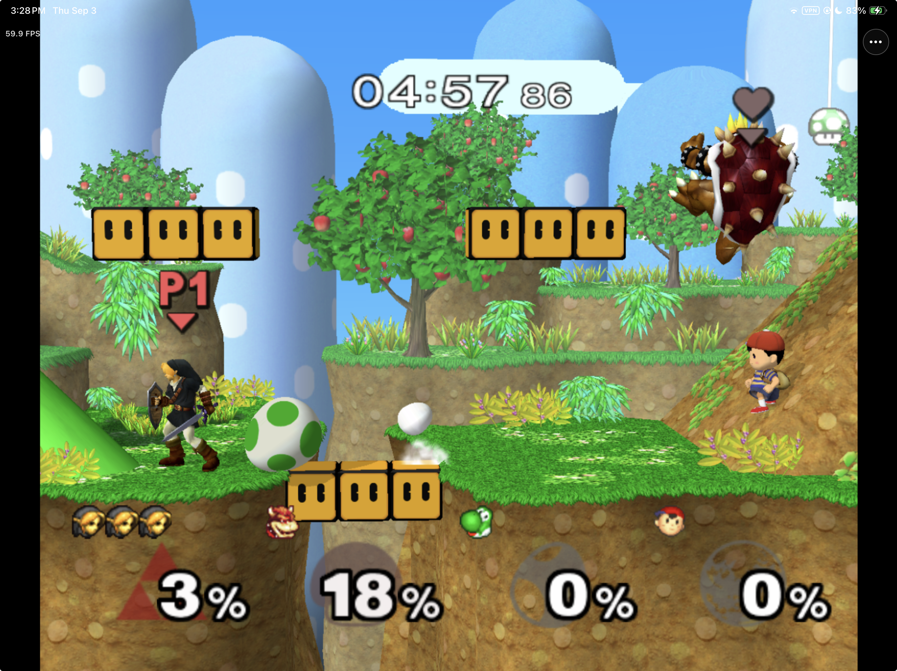

# MeleePad

**Super Smash Bros. Melee on iPhone, iPad, and Apple Silicon Mac through
ahead-of-time recompilation and Metal.**

MeleePad turns a supported copy of Melee into a native Apple app you build
yourself. It uses touch controls, physical controllers, Metal rendering, and a
Dolphin-derived compatibility runtime—without requiring JIT on iPhone or iPad.

<p align="center">
  
  
  
  
  
</p>



*A physical-iPad development build running at 2x resolution. Performance varies
by scene and device; this image is evidence from one observed match, not a
universal performance guarantee.*

**[How it works](#how-meleepad-works) · [Current status](#current-status) ·
[FAQ](#faq) · [Build it](#build-from-source) ·
[Online play](#experimental-multiplayer) · [Get help](#reporting-issues)**

> [!IMPORTANT]
> MeleePad v0.1.0 Preview 2 adds experimental private Internet rooms, Direct IP,
> compatibility checks, and the development public-lobby UI. It is not an
> online-play beta: there is no deployed public game browser, relay, automatic
> matchmaking, ranked play, or Slippi rollback. The downloadable IPA is an
> unsigned, module-free app shell and is **not playable as downloaded**. A
> playable build must be generated locally from your own exact supported game
> image. Performance and rendering still vary by scene and device.

### At a glance

| | What to expect |
|---|---|
| **Platforms** | iPhone, iPad, and Apple Silicon Mac |
| **Game input** | Your own exact USA `GALE01` revision 0 disc image |
| **Distribution** | Source plus an unsigned, non-playable IPA shell; playable builds are generated and signed locally |
| **Controls** | Touch, supported physical controllers, and keyboard on Mac |
| **Online play** | Experimental MeleePad-to-MeleePad private rooms and Direct IP; not yet a public beta |
| **Not included** | Melee, game assets, saves, signing material, or a generated game module |

## How MeleePad works

MeleePad does not depend on a completed source-code decompilation of Melee.
Instead, it uses **static recompilation**: translating the original game's
compiled PowerPC instructions into code that can be compiled for a different
processor before the app runs.

The build pipeline works in five stages:

1. You provide your own supported `GALE01` revision 0 disc image locally.
2. The tooling verifies that exact image and extracts its executable and game
   data. Nothing is downloaded from Nintendo or committed to this repository.
3. [DolRecomp](https://github.com/ExpansionPak/DolRecomp) reads the GameCube
   executable, decodes its PowerPC instructions, and emits portable C in
   manageable generated chunks.
4. Apple Clang compiles those generated chunks ahead of time into an ARM64 game
   module. The iPhone or iPad does not translate that code while you play.
5. [ModernGekko](https://github.com/ExpansionPak/ModernGekko), built on a
   Dolphin-derived runtime, supplies the console environment around that code:
   memory, timing, disc access, graphics, audio, and controller interfaces.
   MeleePad connects that runtime to UIKit, Metal, Apple audio, touch controls,
   and GameController.

The result is a native ARM64 Apple app running ahead-of-time-compiled game code.
Static recompilation replaces the runtime CPU translation layer; the
Dolphin-derived compatibility layer still models the GameCube hardware and
services the game expects. This is therefore most accurately described as a
**native static-recompilation compatibility port**, not a traditional
source-code port and not a stock Dolphin frontend.

The iPhone and iPad app imports a user-supplied game image from Files. The macOS
app provides a native launcher, Metal rendering, keyboard and controller input,
local settings, and developer-facing netplay controls. This repository contains
the Apple integration, source patches, tests, and reproducible build tooling.
It does **not** contain Melee, a disc image, extracted Nintendo assets, saves,
signing material, or a generated game module.

## FAQ

<details>
<summary>Is this possible without a completed Melee decompilation?</summary>

Yes. A traditional decompilation reconstructs human-readable source code.
MeleePad takes a different route: DolRecomp converts the game's existing
PowerPC instructions into generated code that Apple Clang compiles for ARM64.
That makes native execution possible without claiming to have recovered the
game's original source code.

</details>

<details>
<summary>Is MeleePad truly native on iPhone and iPad?</summary>

Yes, in the platform and execution sense. The installed app and generated game
module are ARM64 binaries. Rendering uses Metal, and the app uses native Apple
interfaces for touch, controllers, audio, file import, settings, and lifecycle.
It does not need a browser or just-in-time compiler.

“Native” does not mean the entire GameCube was rewritten by hand. ModernGekko's
Dolphin-derived runtime still provides the hardware behavior that Melee expects.
The most accurate description is a **native static-recompilation compatibility
port**.

</details>

<details>
<summary>Is this an emulator?</summary>

MeleePad shares substantial runtime technology with Dolphin for graphics,
audio, memory, input, and GameCube system behavior. The important difference is
CPU execution: supported Melee code is converted and compiled ahead of time
instead of going through Dolphin's normal runtime JIT or interpreter.

It is best understood as a game-specific static recompilation joined to a
Dolphin-derived compatibility runtime—not a stock Dolphin frontend and not a
from-scratch source port.

</details>

<details>
<summary>Does MeleePad need JIT or special runtime permissions?</summary>

No. The game module is compiled to ARM64 before installation, so normal gameplay
does not generate executable code on the device. A locally installed build still
needs ordinary Apple development signing, just like other apps run from Xcode.

</details>

<details>
<summary>Why does MeleePad require one exact disc revision?</summary>

Static recompilation depends on the executable's exact instructions, addresses,
and data. Even legitimate regional or revision releases differ at those
locations. MeleePad currently supports only the original uncompressed USA
`GALE01` revision 0 image commonly called Melee v1.00.

| Property | Required value |
|---|---|
| Game | Super Smash Bros. Melee (USA) |
| Game ID | `GALE01` |
| Disc number | `0` |
| Disc revision byte | `0` |
| File format | Raw ISO/GCM, not RVZ, WIA, CISO, NKit, ZIP, or 7z |
| Exact size | `1,459,978,240` bytes |
| SHA-256 | `2393aadd346c23e3e44291e7bb7e16dbc4970bc703028261659a87cde9d90484` |

Revision 1/v1.01, revision 2/v1.02, PAL, and Japanese images are not supported.
Renaming another image to `GALE01.iso` does not make it compatible; MeleePad
verifies the file's contents.

</details>

<details>
<summary>Does the repository or app include Melee?</summary>

No. The repository contains no game image, extracted game assets, saves, or
generated game module. You select your own supported image on first launch.
MeleePad validates it, keeps a private local copy in the app container, and
extracts the data the runtime needs. That data stays on your device.

</details>

<details>
<summary>Can I download a playable IPA?</summary>

No. The [Preview 2 prerelease](https://github.com/chrissotraidis/meleepad/releases/tag/v0.1.0-preview.2)
includes source and an unsigned, module-free IPA shell for inspection and
signing-workflow development. It deliberately excludes
`gGALE01_recomp.dylib`, so importing an ISO into that IPA cannot make it
playable.

A playable iPhone or iPad build must be generated locally from your own
supported disc image on an Apple Silicon Mac, then signed with your Apple
development account. Start with the [requirements](#requirements), follow the
[physical-device build steps](#build-for-a-physical-iphone-or-ipad), and finish
with [first-launch game-data import](#first-launch-on-iphone-or-ipad).

</details>

<details>
<summary>Does multiplayer work?</summary>

Experimentally. Preview 2 can create private eight-character room codes through
Dolphin's public traversal service, and Direct IP remains available. Retained
Mac/iPad Simulator tests connected and ran synchronized gameplay in both host
directions.

This is not yet a public multiplayer beta. Physical-device Internet matches,
independent outside networks, complete cross-platform matches and rematches,
real-world NAT success, lifecycle recovery, and a production public-game browser
remain unverified. See [Experimental multiplayer](#experimental-multiplayer) for
the exact boundary.

</details>

<details>
<summary>Which Online Play option should I use?</summary>

- **Public Games** is the easiest discovery flow when a supported lobby service
  is configured. You can see the host, seated players, open seats, room state,
  freshness, and exact build compatibility before joining. This remains a
  local development feature; Preview 2 does not ship with a production public
  browser.
- **Private Room** is the best current choice for friends. The host creates an
  eight-character room code and shares it privately. Dolphin's traversal
  service introduces the devices without exposing the host's IP address in the
  MeleePad UI.
- **Direct IP** is an advanced fallback for a trusted local network or private
  VPN. It exposes the host address, has no relay fallback, and may require UDP
  port forwarding when used across the internet.

All three modes use MeleePad's experimental fixed-delay gameplay transport.
They do not connect to Slippi or provide encrypted gameplay.

</details>

<details>
<summary>Do Private Room players need to be on the same Wi-Fi?</summary>

No. Private Room is specifically the option to test with a trusted player on
another Internet connection. The host creates an eight-character code and the
other player enters it. Dolphin's public traversal service introduces the two
devices, then controller input travels directly between them.

This automatic connection can fail on restrictive routers, cellular or hotel
networks, and some VPNs because Preview 2 has no relay fallback. For the
cleanest first test, use ordinary home Wi-Fi on both sides, turn off VPNs, keep
MeleePad in the foreground, and try switching which player hosts if the first
attempt fails.

</details>

<details>
<summary>What should I do if “Creating lobby” takes a long time?</summary>

Give the first attempt a short chance to finish. MeleePad is registering the
host with Dolphin's public traversal service and waiting for a room code. If
the room appears, record roughly how long creation took; a delayed success is
still useful test evidence.

If it does not finish, tap **Cancel**, turn off any VPN, confirm that the device
has working Internet access, and retry once. Then use **More (•••) → Share
Diagnostic Logs** and report whether the attempt eventually succeeded. Never
post the room code or an IP address in a public issue.

</details>

<details>
<summary>Why are Public Games offline in this build?</summary>

Public Games needs an online MeleePad lobby service. The app cannot safely
discover strangers by itself: a service must publish and expire rooms, keep
connection codes hidden until a compatible player joins, limit spam, carry
room chat, and accept reports.

Preview 2 has no production service address, so the app deliberately fails
closed. It does not send names, chat, or room information to an unknown server,
and it does not fall back to an insecure public HTTP endpoint. The development
service currently stores rooms and reports only in memory and is not suitable
for public operation.

When Public Games launches, lobby traffic will require HTTPS. That protects the
directory and chat connection to the lobby service, but it does not encrypt the
match itself. Gameplay remains a direct peer-to-peer connection. Player names
are display names, not verified accounts. Until the hosted service and its
moderation process are ready, use **Private Room** with people you trust.

You can self-host the reference service on a VPS or Zo Computer for staging,
but it must not be exposed directly. The recommended deployment uses an HTTPS
edge with DDoS protection, a WAF, and route-level limits in front of an outbound
tunnel to a loopback-only lobby process. The
[secure deployment guide](docs/PUBLIC-LOBBY-DEPLOYMENT.md) explains the Zo and
conventional VPS options and the remaining public-launch gates.
For the first isolated hosted proof, use the
[DigitalOcean lobby runbook](docs/PUBLIC-LOBBY-DIGITALOCEAN.md).

</details>

<details>
<summary>How do player names and room chat work?</summary>

The development Public Games UI asks you to confirm the name other players will
see before browsing, joining, or hosting. The confirmed name is saved on that
device; it is not an account, a verified identity, or included in exported
diagnostic logs.

After joining a public room, **Room Chat** lets members type messages up to 160
characters. Messages are relayed by the lobby service—not sent over the
peer-to-peer gameplay channel—are visible only to current room members, and
disappear when the room expires or closes. Sends are rate limited, message
history is bounded, and players can hide or report another sender.

This is a development implementation, not production anonymous chat. Public
deployment still requires durable moderation records, a published support and
abuse contact, and an operated response process.

</details>

<details>
<summary>What happens after an online match ends?</summary>

If Melee is still running, everyone stays in the same synchronized game and
naturally moves from results back to character select. Players can keep playing
without finding or joining the room again. The public directory keeps that room
marked **In match** so new players cannot enter midway through the session.

If the synchronized runtime ends normally, MeleePad returns the public room to
its waiting state and reopens the connected screen. The same group can chat,
ready up, and start again. During play, **More (•••) → Experimental Multiplayer**
shows the current players and room chat. **Return to Game** keeps the connection,
while **Leave Session** disconnects and removes the player's public presence.

</details>

<details>
<summary>Can one lobby service support MeleePad, KartPad, and future games?</summary>

Yes, for discovery. The open Pad Lobby Protocol gives every app its own product
ID and keeps its rooms separate. MeleePad can only browse and join MeleePad
rooms. A small cross-game activity section may show anonymous totals such as
KartPad's open rooms, games in progress, and player count, but not names, chat,
room IDs, connection codes, or IP addresses.

The gameplay layer is not shared. MeleePad keeps its ModernGekko netplay path,
KartPad keeps its own online transport, and each future game needs a small
directory adapter plus its own compatibility rules. KartPad is planned as the
second proof, not implemented in this MeleePad pass.

</details>

<details>
<summary>Why won't Direct IP connect?</summary>

Check these in order:

1. Both players use the same MeleePad version/build and the supported `GALE01`
   revision 0 game data.
2. The host keeps MeleePad open, chooses **Host**, and listens on UDP port
   `2626`; the guest chooses **Join** and enters the host's reachable address
   and the same port.
3. On a local network, both devices are on the same trusted network and local
   network access is allowed.
4. Across the internet, the host's router and firewall allow UDP `2626`, or both
   players use a trusted private VPN. Carrier-grade NAT and some firewalls may
   make direct hosting impossible.

Direct IP has no traversal or relay fallback. If the network cannot accept the
incoming peer, changing the input buffer will not fix discovery. Prefer a
Private Room unless you specifically need Direct IP for controlled testing.

</details>

<details>
<summary>Does online play support four players?</summary>

The development Public Games lobby now supports two-, three-, and four-seat
rooms, and clearly shows who is seated and which spots are open. That is the
lobby experience, not proof of a four-player match.

MeleePad's retained gameplay evidence still covers two connected endpoints.
Four-player gameplay needs explicit protocol, controller-slot, host-loss,
disconnect, latency, and physical-device testing before it can be called
working. Treat four-seat rooms as development UI until that gate passes.

</details>

<details>
<summary>Why doesn't Slippi work with MeleePad?</summary>

No. Slippi is not a service that MeleePad can simply turn on. It combines a
different Melee revision, extensive injected game code, a customized Dolphin
runtime, rollback networking, accounts, and private matchmaking services.

MeleePad currently supports Melee v1.00 and uses its own fixed-delay protocol.
Slippi supports Melee v1.02 and expects Slippi's game modifications and network
protocol. The two systems are not compatible, so MeleePad users cannot join the
normal Slippi player pool. Supporting that would require a major separate port
and cooperation from Project Slippi; it is not planned for MeleePad.

</details>

<details>
<summary>What works on a physical iPhone or iPad today?</summary>

The game launches and plays on a physical iPad with Metal rendering, touch
controls, supported physical controllers, persistent game data and saves, and
the native settings menu. One observed solo run held close to 60 FPS at 2x
resolution; another later run sustained 46–57 FPS under serious thermal
pressure after an extended in-game pause.

Serious water, reflection, and shadow rendering defects remain, and the full
device acceptance matrix is still in progress. Physical-device online play has
not passed its release gates.

</details>

## Current status

| Area | Working now | Important limitations |
|---|---|---|
| macOS | Native Apple Silicon launcher and runner, Metal rendering, keyboard and controller profiles, matches, saves, and settings | Final display and worst-frame acceptance work remains |
| iPhone and iPad | Native app shell, Metal gameplay, touch controls, controller mapping, More menu, exact-image import, persistent saves and settings, and diagnostic export | Serious water, reflection, and shadow rendering defects remain; the full visual, audio, controller, and lifecycle matrix has not passed |
| Performance | A physical iPad can hold 59.9–60.0 FPS/VPS at 2x resolution during observed solo play | Preview 1 can fall to 46–57 FPS in heavier scenes under thermal pressure; results are scene- and device-specific |
| Experimental multiplayer | Preview 2 fixed-delay Private Room and Direct IP transport, eight-character room codes, native Host/Join lobby, compatibility fingerprinting, and synchronized Mac/iPad Simulator runs in both host directions | No public matchmaking endpoint, physical-device/outside-network/full-match beta evidence, relay, or Slippi rollback |
| Distribution | Preview 2 source plus an unsigned, module-free IPA shell; locally generated, locally signed playable apps | Public IPA is not playable as downloaded; no App Store or TestFlight build; the locally generated game module is not distributed |

The combat-only right-stick mapping has passed a hands-on physical-iPad retest,
including the required menu/gameplay behavior. The current evidence, remaining
acceptance rows, and known rendering debt are tracked in
[the goal loop](docs/GOAL-LOOP.md), [project status](docs/STATUS.md), and
[technical debt](docs/TECH-DEBT.md).

The accepted Preview 1 performance debt and the retained physical-device
measurements are summarized in
[the physical-iPad thermal slowdown record](docs/artifacts/2026-09-03/preview1-physical-ipad-thermal-slowdown.md).

## Requirements

To build MeleePad, you need:

- an Apple Silicon Mac;
- Xcode 26.x;
- CMake, Ninja, Git, ripgrep, and Python 3; and
- your own legally obtained USA revision 0 Melee disc image (`GALE01`) in raw
  ISO or GCM form: exactly 1,459,978,240 bytes with SHA-256
  `2393aadd346c23e3e44291e7bb7e16dbc4970bc703028261659a87cde9d90484`.

MeleePad supports that exact USA v1.00/revision-0 image only. The preparation
scripts validate the size, hash, game ID, disc number, and revision, and reject
unsupported or compressed input.

## Build from source

Prepare the pinned public dependencies and your private game input:

```sh
./scripts/bootstrap-dependencies.sh
./scripts/prepare-game.sh /path/to/GALE01.iso
```

These commands build the public tools, validate and extract the supplied game
locally, and generate private build inputs under ignored paths. They never
download or redistribute game data.

Build and open the Apple Silicon macOS app:

```sh
./scripts/package-macos-app.sh
open build-macos/MeleePad.app
```

Build the iOS Simulator core and app:

```sh
./scripts/ios-build-core.sh
./scripts/ios-provision.sh
xcodebuild -project MeleePad.xcodeproj -scheme MeleePad \
  -configuration Release \
  -destination 'platform=iOS Simulator,name=iPad Pro 13-inch (M5)' \
  CODE_SIGNING_ALLOWED=NO build
```

Release maintainers can build the publishable module-free iPhoneOS shell and
package it reproducibly with:

```sh
xcodebuild -project MeleePad.xcodeproj -scheme MeleePad \
  -configuration Release -destination 'generic/platform=iOS' \
  -derivedDataPath build/DerivedData-public \
  CODE_SIGNING_ALLOWED=NO CODE_SIGNING_REQUIRED=NO build
./scripts/package-public-ios-ipa.sh \
  build/DerivedData-public/Build/Products/Release-iphoneos/MeleePad.app
```

The packager refuses game modules, game/save files, provisioning profiles,
signatures, and private host paths. Its output remains an app shell; it does not
replace the playable local-build process below.

### Build for a physical iPhone or iPad

First build the device core and locally generated game module:

```sh
./scripts/ios-build-core-device.sh
open MeleePad.xcodeproj
```

Then, in Xcode:

1. Select the **MeleePad** target and open **Signing & Capabilities**.
2. Select your Apple development team. If Xcode reports that the bundle
   identifier is unavailable, change it to a unique reverse-DNS identifier
   owned by your team.
3. Connect and unlock the iPhone or iPad, enable Developer Mode if required,
   and select that device as the run destination.
4. Choose **Product → Run** to build, sign, install, and launch MeleePad.

Keep the same bundle identifier for later updates if you want iOS to preserve
the app's private game data, saves, controller settings, and preferences.
Changing the identifier creates a separate app container.

Generated sources, extracted game data, app packages, profiles, saves, and
locally recompiled modules are ignored and must not be committed.

## First launch on iPhone or iPad

MeleePad never downloads or bundles game data.

1. Launch MeleePad and open the **More (•••)** menu.
2. Choose **Game Data & Saves**, then **Import or Reimport Game Data**.
3. Select your supported raw ISO or GCM image in Files.
4. Leave the app open while it validates, extracts, and atomically activates
   the private game data.
5. Start playing after the first rendered frame appears.

A failed reimport leaves the prior working data active. Removing stored game
data keeps saves and control settings separate.

## Controls and settings

The landscape touch layout provides move and C sticks, compact L and R
shoulder buttons, A/B/X/Y/Z, Start, and a grouped editable directional pad.
The **More (•••)** menu contains render scale, aspect ratio, FPS diagnostics,
touch-layout editing and reset, controller mapping, game-data controls, and
diagnostic export. Connecting a physical controller can automatically hide the
touch overlay.

The built-in macOS keyboard controls are:

| Action | Key |
|---|---|
| Move | W, A, S, and D |
| Attack or confirm | J |
| Special or back | K |
| Jump | Space or U; I is the second jump button |
| C-stick or smash attack | Arrow keys |
| Shield | Q or E |
| Grab | O |
| Start or pause | Return |

Launching the macOS app replaces only MeleePad's internal automation pipe
profile with this interactive keyboard profile. Existing custom keyboard and
physical-controller profiles are preserved.

## Experimental multiplayer

> [!WARNING]
> **Online play is not ready for general use.** Preview 2 contains experimental
> private rooms and Direct IP. Its Public Games interface has passed local
> development testing, but no production public-game service is deployed.

| Available in Preview 2 | Not available yet |
|---|---|
| Private eight-character room codes | Production public-game browser |
| Direct IP for advanced testing | Automatic or ranked matchmaking |
| Two-player Mac/iPad Simulator evidence | Verified four-player online rooms |
| Physical-iPad room creation | Physical-device completed Internet matches |
| Compatibility checks and desync shutdown | Relay fallback or encrypted gameplay |
| Native Host, Join, Ready, and Start flow | General multiplayer-beta evidence |

### What a player can do in Preview 2

1. Arrange a game with another MeleePad player outside the app.
2. Confirm that both players use Preview 2 build 5, the exact supported
   `GALE01` revision 0 image, and matching gameplay settings.
3. The host opens **More (•••) → Online Play → Private Room → Host**.
4. After the app displays an eight-character room code, the host sends it to
   the other player through a trusted channel.
5. The guest opens **Private Room → Join**, enters that code, and connects.
6. Both players verify the compatibility state, mark Ready, and the host starts
   the match.

This flow depends on Dolphin's public traversal service. There is no in-app
list of strangers to play in the shipped configuration.

Players do not need the same public IP address or Wi-Fi network. In fact, the
most useful community test places the two players on independent networks.
Follow the [Private Room community test guide](docs/PRIVATE-ROOM-TESTING.md) and
report the complete result, including slow or failed attempts.

### Safety and privacy today

- Play only with people you trust.
- A room code helps two devices find each other. It is not a password, identity
  check, or encryption key.
- Gameplay travels directly between peers and is currently plaintext.
- Some routers and firewalls will reject a connection because there is no relay
  fallback.
- Exported diagnostics should never include full IP addresses, room codes, game
  data, saves, or signing material.

<details>
<summary>How does Preview 2 connect the players?</summary>

- Both players run the match locally; MeleePad exchanges synchronized
  controller input rather than streaming video.
- Both devices need the same MeleePad build, supported game revision, module,
  and compatible settings.
- The transport uses fixed delay. It is not Slippi rollback netcode.
- Gameplay is peer-to-peer over ENet after traversal introduction. MeleePad
  does not host the match or stream the game.
- There is no relay fallback. Some NAT or firewall combinations may fail even
  when the room code resolves.
- The joining player is assigned another GameCube controller port.
- A synchronization mismatch stops the session instead of allowing the two
  games to continue in different states.

</details>

### What has been verified

| Test | Result |
|---|---|
| Two Macs using direct connection | One full match completed through results and lobby return, with saves unchanged |
| Mac and iPad direct connection | Clean rebuilt peers sustained synchronized execution in both host directions beyond the old failure point |
| iPhone multiplayer interaction | Compile coverage only; no completed device match |
| Public Internet room code | Dolphin's live traversal service created/resolved fresh codes; Mac/iPad Simulator sustained about 4,700 rendered frames in each host direction |
| Physical iPad room creation | Preview 2 build 5 reached `Internet room is ready` and received a room code; no remote peer joined, so this is not match or P2P acceptance |
| Public room discovery | Local lobby service discovered a live Mac traversal host and authorized an iPad Simulator join; production service is not deployed |

The earlier Mac/iPad canonical failure was stale-build contamination and did
not reproduce after clean rebuilds; no timing tolerance or RAM exclusion was
used. The stronger full-match and real-network acceptance work continues in
the [multiplayer goal loop](docs/NETPLAY-BETA-GOAL-LOOP.md).

### Private Room, Public Games, and Direct IP

- **Private Room** is the working Internet-room preview. Players arrange a game
  elsewhere and exchange an ephemeral room code privately.
- **Public Games** is the planned discovery layer. Its native UI can show
  compatible room cards and supports bounded room chat, Hide, and Report in
  local development tests. No production endpoint is deployed.
- **Direct IP** bypasses discovery and traversal. It is intended for local
  networks and advanced testing.

The public browser is designed so room listings never reveal traversal codes.
Only an authorized, compatible Join response discloses the connection code.
Release builds fail closed when no production service is configured.

<details>
<summary>How does Direct IP work, and when should I use it?</summary>

Use Direct IP for controlled testing on a trusted local network or private VPN:

1. The host chooses **Host**, keeps UDP port **2626**, and creates the lobby.
2. The host shares an IP address or hostname reachable by the joining device.
3. The second player chooses **Join**, enters that address and the same port,
   then connects.
4. Both players mark themselves **Ready**; the host starts the synchronized
   session.

UDP port 2626 is Dolphin's standard direct-netplay listening port. It is not a
MeleePad server. Same-network testing normally requires no router change;
testing across the public internet may require UDP port forwarding or a private
VPN. The current gameplay channel is plaintext, so use it only with trusted
people on a private test network. Do not expose it as a public service.

</details>

Local service and Simulator instructions are in
[services/lobby/README.md](services/lobby/README.md). The remaining discovery,
moderation, and deployment gates are in the
[public lobby goal loop](docs/PUBLIC-LOBBY-GOAL-LOOP.md). The reusable,
multi-game directory boundary and MeleePad-first implementation sequence are in
the [Pad Lobby Protocol goal loop](docs/PAD-LOBBY-PROTOCOL-GOAL-LOOP.md).

### Plan after Preview 2

The next-preview plan is deliberately staged:

1. run bounded Private Room community tests on Preview 2 build 5, beginning
   with trusted two-player pairs on independent networks;
2. finish full matches on physical Apple devices across independent networks,
   including NAT, disconnect, backgrounding, save, input, audio, and thermal
   coverage;
3. use the connection-success, latency, desync, and rematch evidence as the
   go/no-go gate for further public-lobby work;
4. only after that gate passes, deploy a supported HTTPS staging discovery
   service with durable moderation, rate limits, monitoring, retention
   deletion, and rollback; and
5. freeze one version/build/protocol tuple for the next preview, keeping Public
   Games disabled if either gameplay or service acceptance is incomplete.

The detailed gates and stop rules are in the
[public lobby goal loop](docs/PUBLIC-LOBBY-GOAL-LOOP.md).

<details>
<summary>What must pass before this can be called a beta?</summary>

Before the UI can be called **Online Play with Friends (Beta)**, one unchanged
build must complete full Mac/iPad, Mac/iPhone, and iPad/iPhone matches; pass
disconnect, backgrounding, save, input, performance, and privacy checks; and
connect across separate networks through a working short room-code flow. The
[multiplayer beta plan](docs/NETPLAY-BETA-GOAL-LOOP.md) defines the complete
acceptance matrix.

Four-player online play has additional gates: four stable controller slots,
four-seat room state, coordinated match start, peer-loss behavior, latency and
buffer policy, full-match determinism, and physical-device thermal testing.

</details>

## Reporting issues

Use **More (•••) → Share Diagnostic Logs** to export a diagnostic package. Then
[open a MeleePad GitHub issue](https://github.com/chrissotraidis/meleepad/issues/new)
and include:

- the Apple device and OS version;
- whether touch, keyboard, or a named controller was in use;
- the scene and steps needed to reproduce the problem;
- relevant display, audio, and controller settings; and
- the diagnostic export, after checking it for anything you do not want to
  share.

For Online Play, also include whether you hosted or joined, whether the players
used the same or separate networks, whether either side used a VPN, approximate
time to receive the room code, approximate ping if a peer connected, and
whether a full match, results screen, character select, and rematch completed.
The [community test guide](docs/PRIVATE-ROOM-TESTING.md) contains a copyable
report template.

Never upload a game image, extracted game data, save files, signing material,
IP addresses, or room codes.

## Testing and project policy

The repository uses a proof-gated workflow: small falsifiable changes, focused
regressions, live visual evidence for playability claims, ROM-safe Git history,
and explicit separation between verified, partial, and blocked work.

Run the repository safety suite before publishing:

```sh
./scripts/check-repository.sh
```

The final iPad Simulator performance gate must be played by a person; automated
touch input cannot replace it. With exactly one Simulator booted, run:

```sh
./scripts/run-g8-human-acceptance.sh
```

The harness starts a fresh Release build, records the complete screen without
UI polling, and retains same-session runtime rows and hashes outside Git. Follow
its displayed match instructions, play for five uninterrupted combat minutes,
reach results, return to the menu, and finish the capture from the terminal.
The script reports numeric thresholds but never declares acceptance; a person
must still review the recording and every phase.

See the [product requirements](docs/PRD.md), [engineering journal](docs/JOURNAL.md),
and [current status](docs/STATUS.md) for the acceptance contract, chronology,
and detailed evidence.

## Legal

MeleePad is an independent compatibility project and is not affiliated with or
endorsed by Nintendo, HAL Laboratory, or the Dolphin project. MeleePad does not
provide copyrighted game data; users are responsible for supplying and using
their own legally obtained game image in accordance with applicable law.
